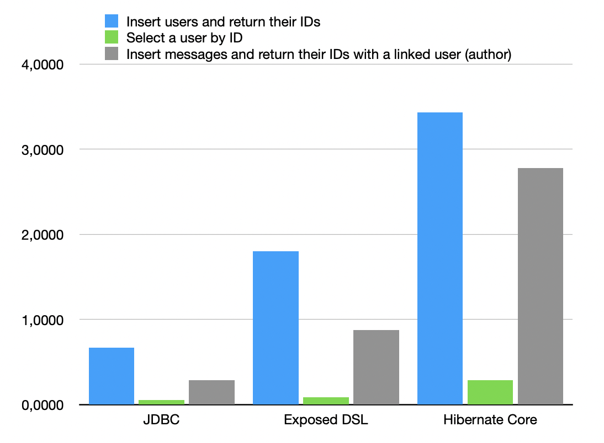

Stupid benchmark
----------------
Kotlin: Exposed DSL vs JDBC using PostgreSQL driver

# Why is it called "stupid"?
This is not an objective bullsh... benchmark that gives an extremely rough estimate of 
performance. I created it mainly out of the need for this test because I 
couldn't find it on the internet. The benchmark results presented below were 
obtained on the same machine where the DBMS was running. Please, treat them 
with a grain of salt, or rather read the source code and run it yourself: the 
queries might not have been written optimally enough.

# Stupid results

|                                                                  | JDBC  | Exposed DSL | Hibernate Core |
|------------------------------------------------------------------|-------|-------------|----------------|
| Insert users and return their IDs                                | 0,670 | 1,800       | 3,430          |
| Select a user by ID                                              | 0,056 | 0,086       | 0,287          |
| Insert messages and return their IDs with a linked user (author) | 0,290 | 0,880       | 2,780          |

&ast; Less is better

&ast;&ast; Exposed DSL returns all values, not just IDs.
